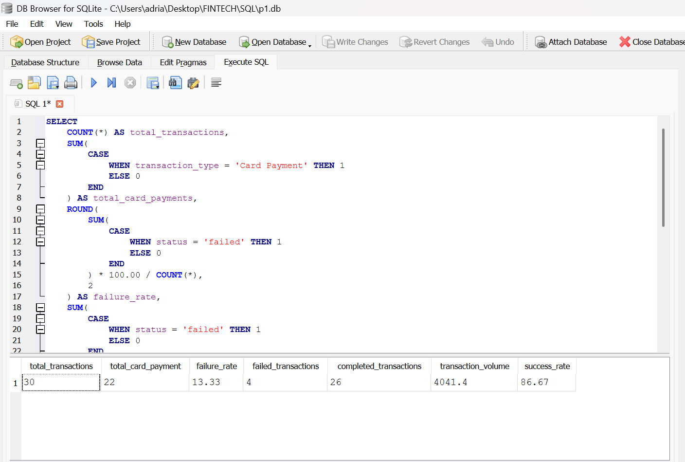
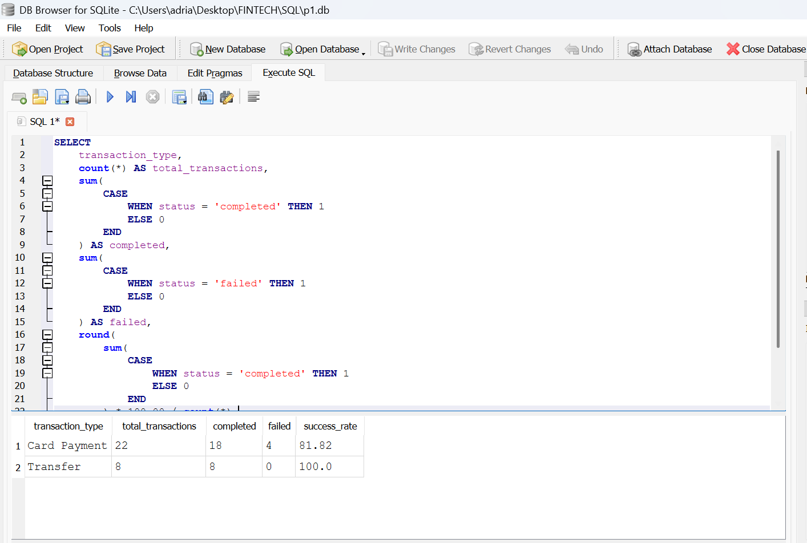
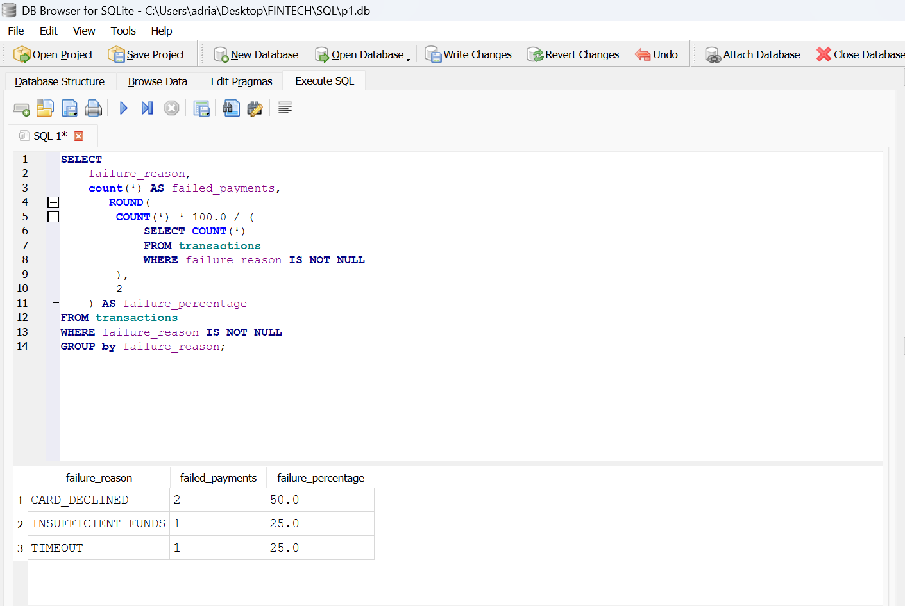
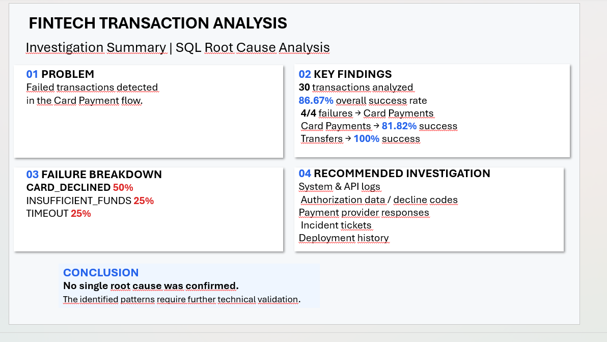

# Fintech Transaction Analysis – SQL Root Cause Analysis

## O projekte

Tento projekt predstavuje praktickú SQL analýzu transakcií v simulovanom fintech systéme. Cieľom bolo analyzovať úspešnosť platieb, identifikovať neúspešné transakcie a navrhnúť ďalšie kroky na preverenie ich príčin.

## Použité technológie

- SQL
- SQLite
- DB Browser for SQLite
- Data Analysis
- KPI Monitoring
- Root Cause Analysis

## Databáza

Projekt pracuje s tromi prepojenými tabuľkami:

- `customers` – informácie o zákazníkoch
- `accounts` – zákaznícke účty
- `transactions` – transakcie, sumy, stavy a dôvody zlyhania

Vzťah: `customers → accounts → transactions`

## Hlavné KPI

- **Celkový počet transakcií:** 30
- **Úspešné transakcie:** 26
- **Neúspešné transakcie:** 4
- **Success Rate:** 86,67 %
- **Failure Rate:** 13,33 %
- **Objem úspešných transakcií:** 4 041,40 €

## Analýza typov transakcií

**Card Payments**
- Celkom: 22
- Úspešné: 18
- Neúspešné: 4
- Success Rate: 81,82 %

**Transfers**
- Celkom: 8
- Úspešné: 8
- Neúspešné: 0
- Success Rate: 100 %

**Hlavné zistenie:** Všetky 4 neúspešné transakcie sa nachádzali v Card Payment flow.

## Failure Analysis

- `CARD_DECLINED` – 2 prípady (50 %)
- `INSUFFICIENT_FUNDS` – 1 prípad (25 %)
- `TIMEOUT` – 1 prípad (25 %)

## Root Cause Investigation

Analýza identifikovala opakované zamietnutia karty na účte 101 a jednotlivé prípady nedostatku prostriedkov a timeoutu na ďalších účtoch.

Zistené patterns predstavujú hypotézy, nie potvrdené príčiny. Na ich overenie by bolo potrebné preskúmať systémové a API logy, autorizačné údaje, odpovede poskytovateľa platieb a incidenty.

## Odporúčané kroky

1. Preveriť autorizačné kódy, limity a stav karty pri CARD_DECLINED.
2. Skontrolovať spracovanie INSUFFICIENT_FUNDS a chybové hlásenia pre zákazníka.
3. Analyzovať API response times a provider logs pri TIMEOUT.
4. Priebežne monitorovať úspešnosť Card Payments a výskyt chýb.

## Obmedzenia projektu

Analýza vychádza z malej simulovanej databázy s 30 transakciami. Výsledky slúžia na demonštráciu SQL analýzy a postupu investigácie, nie ako dôkaz problému v reálnom produkčnom systéme.

## Postup analýzy

**Business Problem → SQL Analysis → KPI Monitoring → Failure Segmentation → Root Cause Hypotheses → Recommendations**

## Výsledky SQL analýzy

### 1. KPI Overview

### 2. Transaction Type Analysis

### 3. Failure Analysis

### 4. Investigation Summary

